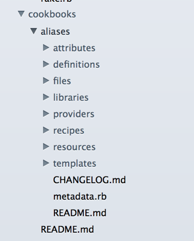

Part 2 - Working with Chef Repo
===============================
Prerequisite Steps
------------------
1. Sign up for a free [Chef Hosted account][chef-hosted] and download your `knife.rb` and `.pem` files to your `~/Downloads` folder. You should have these 3 files:

        [your_organization_name]-validator.pem
        [your_username].pem
        knife.rb

    For example, if your username was "seth" and you organization was "fluffy":

        fluffy-validator.pem
        seth.pem
        knife.rb

1. Clone the `chef-repo` into the `Development` folder from github. In Terminal:

        mkdir ~/Development
        git clone git://github.com/opscode/chef-repo ~/Development/chef-repo

1. Create the `.chef` directory and move your private files there. In Terminal:

        mkdir ~/Development/chef-repo/.chef
        mv ~/Downloads/*.pem ~/Development/chef-repo/.chef/
        mv ~/Downloads/knife.rb ~/Development/chef-repo/.chef/

1. Open up Terminal (see Part 1 if you forget) and "Change Directory" (`cd`) into our `chef-repo`:

        cd ~/Development/chef-repo

    **[Note]** All the commands in the rest of this Quick Start guide should be run from this directory.

1. Install chef:

        gem install chef

1. Verify your credentials are correct with `knife` (the CLI tool for Chef). In Terminal:

        knife client list

    _[TODO]_ What output do we see here?


Working with chef-repo
----------------------
1. Open up the `chef-repo` in your favorite editor. If you don't have a plain text editor, download a [free trial of Sublime Text 2][sublime-text-2]. You should see something like this:

    

    *[Note]* The files in your `.chef` directory is very important. These are **your** credentials for accessing the Chef Server. Do not share them with anyone else. Treat them like a password.

    *[Info]* You'll notice a lot of `README.md` files. These are for your reference - feel free to read them now, but that's not required to continue with this Quick Start guide.

1. We are going to setup a basic apache installation first. Download the `apache2` and `networking_basic` community cookbooks using `knife`. In Terminal:

        knife cookbook site install apache2
        knife cookbook site install networking_basic

    *[Info]* `knife` is the command-line tool for Chef on your workstation.

1. Look in your cookbooks directory and you should now see two folders, apache2 and networking_basic.

Create a Simple Cookbook
------------------------
We leveraged the power of the [Community Site][apache2-cookbook] to install 2 cookbooks, but let's also write our own cookbook before bootstrapping our first node. We will be adding shell aliases and global environment variables.

1. Install the `magic_shell` cookbook using `knife`:

        knife cookbook site install magic_shell

1. Create a new cookbook called "aliases":

        knife cookbook create aliases

    You should see output like this:

        $ bundle exec knife cookbook create aliases
        ** Creating cookbook aliases
        ** Creating README for cookbook: aliases
        ** Creating CHANGELOG for cookbook: aliases
        ** Creating metadata for cookbook: aliases

1. Expand the `cookbooks` folder and notice that a new folder `aliases` has been created:

  

1. Open up the `metadata.rb` and add a dependency on `magic_shell` so we can use it in our cookbook:

    ```ruby
    name             'aliases'
    maintainer       'YOUR_COMPANY_NAME'
    maintainer_email 'YOUR_EMAIL'
    license          'All rights reserved'
    description      'Installs/Configures aliases'
    long_description IO.read(File.join(File.dirname(__FILE__), 'README.md'))
    version          '0.1.0'

    # add this
    depends 'magic_shell', '~> 0.2.0'
    ```

    If you're not familiar with Chef, this allows us to leverage the `magic_shell` LWRP inside our `aliases` cookbook.

    *[Info]* It's best practice to fill in the `maintainer` and `maintainer_email` with your information, but that's unnecessary for this Quick Start guide.

1. Open up the default recipe in your Text Editor (it's in `cookbooks/aliases/recipes/default.rb`). It should look like this:

    ```ruby
    #
    # Cookbook Name:: aliases
    # Recipe:: default
    #
    # Copyright 2013, YOUR_COMPANY_NAME
    #
    # All rights reserved - Do Not Redistribute
    #
    ```

1. Let's create some shell aliases - feel free to use these or make up your own:

    ```ruby
    # Alias `h` to go home
    magic_shell_alias 'h' do
      command 'cd ~'
    end

    # Alias `sites` to cd into apache
    magic_shell_alias 'sites' do
      command "cd #{node['apache']['dir']}/sites-enabled"
    end

    # Set Vim as the default editor
    magic_shell_environment 'EDITOR' do
      value 'vim'
    end
    ```

    The comments are pretty self-explanatory, and these aliases are created for all users.

1. Save these changes to git:

        git add .
        git commit -m "Created aliases recipe"

Upload the Cookbooks
--------------------
In order for our nodes to download these cookbooks, we need to upload them to the Hosted Chef Server.

1. Upload all our cookbooks to the Chef Server with `knife`:

        bundle exec knife cookbook upload -a

    *[Note]* You need to upload cookbooks to your Chef Server in order for nodes to find them.

Recap
-----
We now have 3 recipes:

  1. `recipe[apache2]` - via Berkshelf
  1. `recipe[networking_basic]` - via Berkshelf
  1. `recipe[aliases]` - created ourselves

If you look at the git log, you can see all the changes we've made thus far:

    git log

We can add these recipes to our `run_list` in [Part 3 of this Quick Start guide][part-3]!

[chef-hosted]: http://www.opscode.com/hosted-chef/ "Sign up for Hosted Chef"
[management-console]: http://manage.opscode.com "Opscode Management Console"
[sublime-text-2]: http://www.sublimetext.com/2 "Sublime Text 2"
[berkshelf]: http://berkshelf.com "Berkshelf"
[apache2-cookbook]: http://community.opscode.com/cookbooks/apache2 "Opscode Apache2 Cookbook"
[part-3]: ../Part+3+-+Converging+the+Node "Part 3 - Converging the Node"
